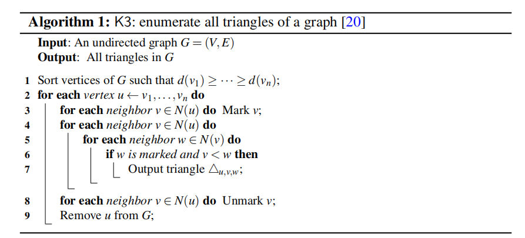

### K3 算法

用来计算图中三角形的个数（三角形指三个顶点互相连接形成的图形）
$ y_k=\varphi(u_k+v_k)$ 
$J\alpha(x) = \sum{m=0}^\infty \frac{(-1)^m}{m! \Gamma (m + \alpha + 1)} {\left({ \frac{x}{2} }\right)}^{2m + \alpha}$
注意下面的写法：(右对齐)
$$ y_k=\varphi(u_k+v_k)$$

算法如下：

1.将所有边按$d(v)$降序排序
2.按排序队列对每一条边$u$进行遍历
&emsp;&emsp;3.标记所有$v\subseteq N(u)$的顶点
&emsp;&emsp;4.对每个$v\subseteq N(u)$的顶点进行遍历
&emsp;&emsp;&emsp;&emsp;5.对每一个顶点$w\subseteq N(v)$，若$w$被标记且$v<w$,即找到一个三角形（被标记代表$w$即与$v$连通又与$u$连通，$v<w$判断两个顶点的id,避免同一个三角形计数两次）
6.移除所有标记
7.将顶点$u$移除，避免重复计数
